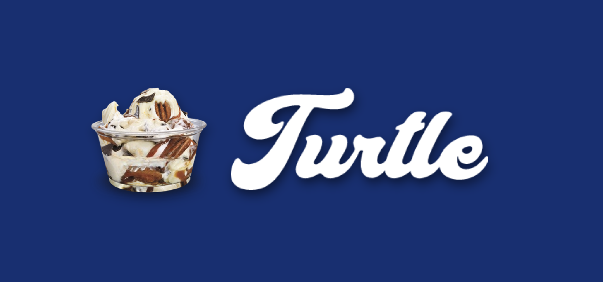

### 

# Click [here](https://hewsonschulz.github.io/Turtle) to use Turtle right now!

## About Turtle

Turtle is a full-stack application that was developed by [Hewson Schulz](https://github.com/HewsonSchulz) during his time at [Nashville Software School](https://nashvillesoftwareschool.com/). It was created for his final capstone project, and uses [React](https://react.dev/) for its client-side, and [Django REST Framework](https://www.django-rest-framework.org/) for its server-side.

## What is Turtle?

Turtle is a tool that allows users to organize, modify, and create custard flavors! Turtle makes it easy to make your custard flavor ideas into a reality with just the click of a button.

## Where is Turtle?

This application has been deployed! You can view the site live at [hewsonschulz.github.io/Turtle](https://hewsonschulz.github.io/Turtle). Please be aware that although this project is currently very comprehensive, some things may still be subject to change.

The client-side is being hosted right here on GitHub, and the server-side is being hosted by the good people at [Digital Ocean](https://www.digitalocean.com).
